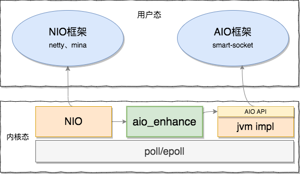

aio_enhance（音译：硬汉） 是一款无侵入式的 Java AIO 内核增强类库，解决原生 AIO 通信设计中存在的缺陷，提供更高效、更稳定的 通信能力。

aio_enhance 采用了 NIO 技术实现了一套全新的异步线程模型，兼容完整的 Java AIO 接口。用户可自由选择 Java 原生提供的，或则 aio_enhance 增强的 AIO 实现，整体架构如下图。



## 一、适用场景

如果您符合以下几个条件，aio_enhance 会是一个不错的选择。

- 基于 Java AIO 实现的通信场景；
- 对高并发有严苛要求；
- 多核CPU环境（经作者验证，28核CPU下有显著性能提升，4核CPU无需引用aio_enhance，其他需要用户自行评估）；

## 二、目的

**2.1 解决平台兼容性问题。**

Java 原生 AIO 在 Mac 操作系统下存在兼容性问题，进行性能压测会偶发性的系统崩溃。

**2.2 修复官方 AIO 架构缺陷**

 Java 原生 AIO 在底层架构设计上存在缺陷（参考：[Java AIO通信模型](http://openjdk.java.net/projects/nio/resources/AsynchronousIo.html)）。多核 CPU 环境下处理高并发请求，会引发比较严重的锁竞争现象，以致无法充分发挥机器性能。

普通4核机器竞争压力不大，AIO 的运行表现实测优于NIO。但随着 CPU 核数的增加，AIO 的性能优势逐渐下降。

**2.3 优化 AIO 线程模型**

Java AIO 相较于 NIO 多了一层异步线程模型，极大降低了开发人员的编程难度。但是通信过程中的 accept、connect、read、write 等事件都是复用同一组线程资源，容易造成读写回调进入**死锁状态**。 AIO通信框架在设计上需要特别关注这一点，但如果引入 aio-enhance 则无此顾虑。

## 三、集成

**步骤一：依赖**

引入增强包：aio-enhance.jar。可以通过maven方式引入依赖，亦可直接下载 jar 包并导入classpath。

**步骤二：启动**

可以通过硬编码的方式设置系统属性，如下：

```java
System.setProperty("java.nio.channels.spi.AsynchronousChannelProvider", "org.smartboot.aio.EnhanceAsynchronousChannelProvider");
```

也可在 java 启动命令行中设置，如下：

```bash
java -Djava.nio.channels.spi.AsynchronousChannelProvider=org.smartboot.aio.EnhanceAsynchronousChannelProvider xxx.jar
```

## 四、比较验证
待补充

## 地摊云经济
捐赠摊位已摆好，扫码请作者喝杯咖啡。


